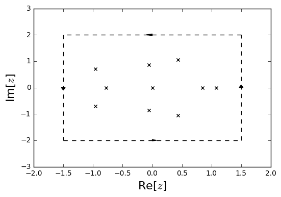

# cxroots
A Python module to compute all the (simple) zeros of an analytic function within a given contour.

---

## Introduction

Given a contour $C$ in the complex plane and a function $f(z)$ (and optionally it's derivative $f'(z)$) which:

* Has no roots or poles on $C$
* Is analytic in the interior of $C$
* Has only simple roots in the interior of $C$

the module is able to compute all the roots of within $C$.


```python
from cxroots import Rectangle, showRoots, findRoots, demo_findRoots
from numpy import sin, cos

rect = Rectangle([-1.5,1.5],[-2,2])
f  = lambda z: z**10 - 2*z**5 + sin(z)*cos(z/2)
df = lambda z: 10*(z**9 - z**4) + cos(z)*cos(z/2) - 0.5*sin(z)*sin(z/2)
showRoots(rect, f, df)
```





The implementation is primarily based on [1] where the number of roots within a contour, $N_C$, is calculated by numerical integration of the Cauchy integral,
\begin{equation} 
N_C = \frac{1}{2\pi i} \oint_C \frac{f'(z)}{f(z)}.
\end{equation}
The original contour is subdivided until each sub-contour only contains a single root and then the Newton-Raphson method is repeatedly used with random startpoints until the root within each sub-contour is found.

If $f'(z)$ is not provided by the user then it is approximated with a Taylor expansion as in [2].


```python
findRoots(rect, f)
```


    ((-0.051732467259847377+0.86479412355070606j),
     (0.84751999573672776+1.2631151125079103e-18j),
     (7.8029627392746349e-23-3.746546563497014e-24j),
     (0.43678493161695536+1.0565420188099093j),
     (1.0834406707107858+1.4200351245887362e-15j),
     (0.43678493161695553-1.0565420188099091j),
     (-0.96178623941763552+0.70901063743402126j),
     (-0.051732467259847391-0.86479412355070606j),
     (-0.77754608881415588-8.223178586068228e-15j),
     (-0.96178623941762409-0.70901063743401693j))


### Future improvements:
* Allow for multiplicities of roots within $C$.  Perhaps using the method of formal orthogonal polynomials suggested in [3]
* Approximate the roots of $f$ within a contour as the zeros of a constructed polynomial [2]
* If $f'(z)$ is not provided then use the approximation to $f'(z)$ in the Newton-Raphson method

### Installation
Can be downloaded from GitHub and installed by running the included 'setup.py' with
```bash
python setup.py install
```

### Documentation
For a tutorial on the use of this module and a discrption of how it works see the [documentation](docs/main.ipynb).

---

#### References
[1] M. Dellnitz, O. Schütze and Q. Zheng, "Locating all the Zeros of an Analytic Function in one Complex Variable" J. Compu. and App. Math. (2002) Vol. 138, Issue 2

[2] L.M. Delves and J.N. Lyness, "A Numerical Method for Locating the Zeros of an Analytic function" Mathematics of Computation (1967) Vol.21, Issue 100

[3] P. Kravanja, T. Sakurai and M. Van Barel, "On locating clusters of zeros of analytic functions" BIT (1999) Vol. 39, No. 4


```python

```
